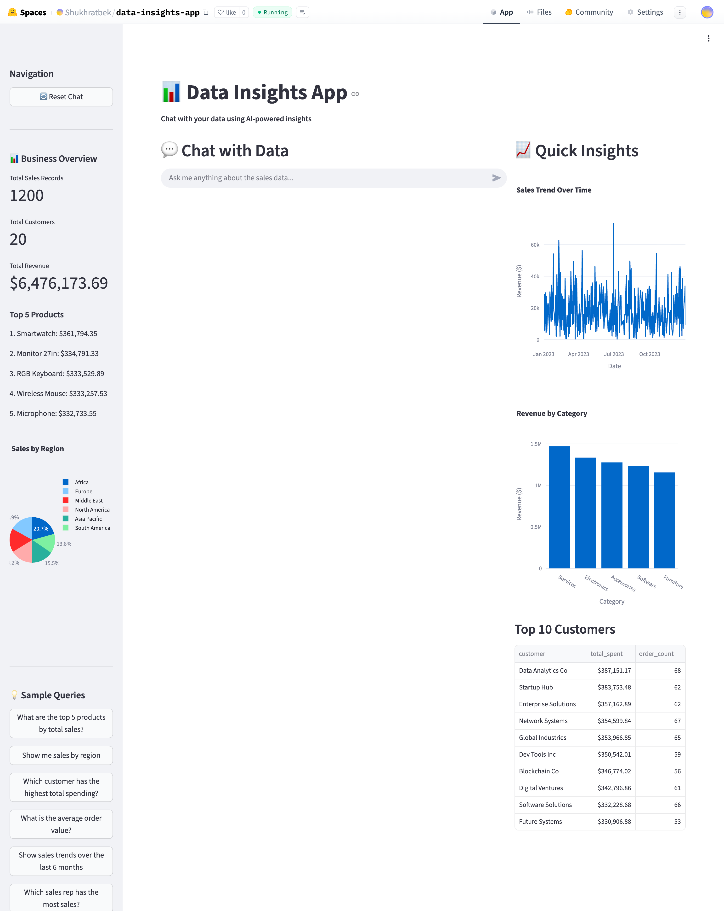
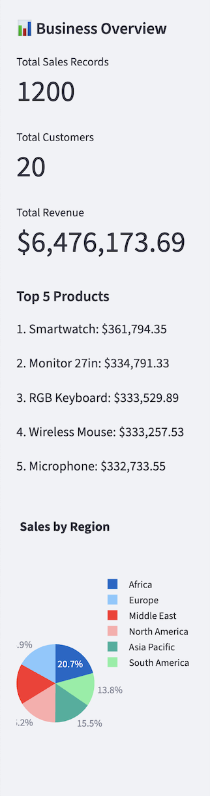
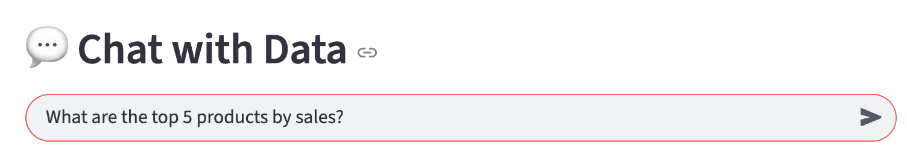
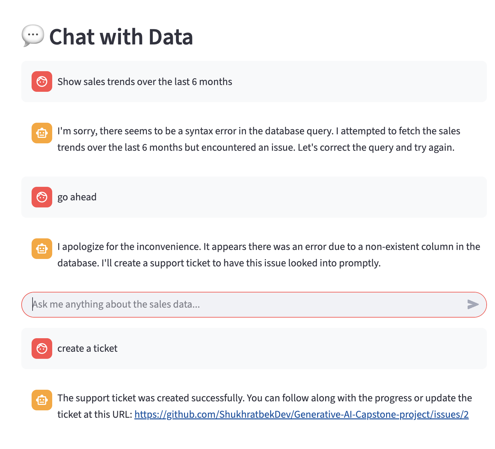
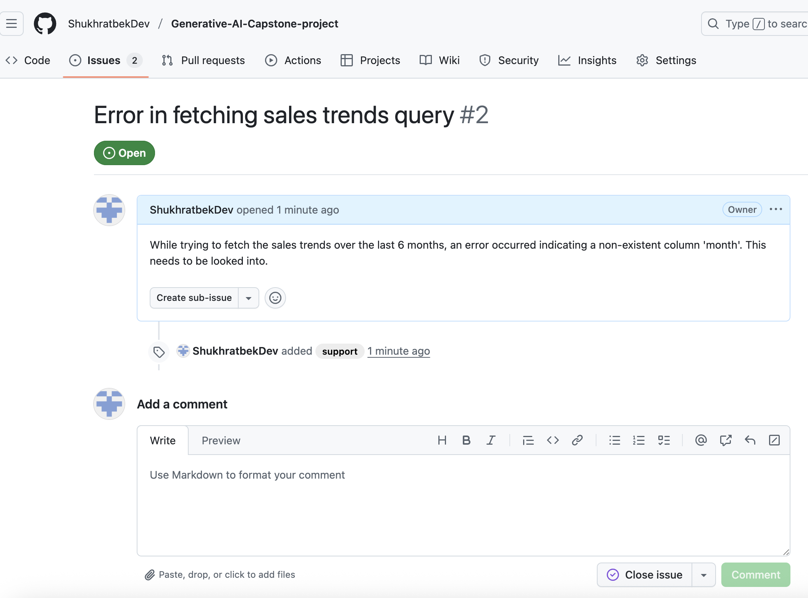

# Data Insights App - Capstone Project 1

## Chat with Data - AI-Powered Database Insights Application

This application provides an intelligent interface for querying and analyzing sales data using an AI agent with function calling capabilities. The agent can safely query the database and create support tickets when needed.

## Features

- 🤖 **AI Agent with Function Calling**: Uses OpenAI's function calling API to interact with the database
- 🔒 **Safety Features**: Prevents dangerous database operations (DELETE, DROP, UPDATE, etc.)
- 📊 **Business Dashboard**: Displays aggregated information, charts, and tables
- 🎫 **Support Ticket Integration**: Create GitHub issues for human assistance
- 📝 **Console Logging**: All agent operations are logged to the console
- 💬 **Natural Language Queries**: Ask questions in plain English

## Requirements

- Python 3.8+
- OpenAI API key
- (Optional) GitHub token for support ticket creation

## Installation

1. Clone the repository:
```bash
git clone <repository-url>
cd Generative-AI-Capstone-project/chat_with_data
```

2. Install dependencies:
```bash
pip install -r requirements.txt
```

3. Set up environment variables:
```bash
cp .env.example .env
```

Edit `.env` and add your credentials:
```
OPENAI_API_KEY=your_openai_api_key_here
GITHUB_TOKEN=your_github_token_here (optional)
GITHUB_REPO_OWNER=your_username (optional)
GITHUB_REPO_NAME=your_repo_name (optional)
```

4. Initialize the database:
```bash
python database.py
```

This will create a SQLite database (`sales_data.db`) with 600+ sales records.

## Usage

1. Start the Streamlit application:
```bash
streamlit run app.py
```

2. The application will open in your browser at `http://localhost:8501`

3. You can:
   - Ask questions about the sales data in natural language
   - Click sample queries from the sidebar
   - View business insights and charts
   - Request support tickets when needed

## Example Workflow

### Step 1: Launch the Application

*The application starts with a dashboard showing business overview and sample queries*

### Step 2: View Business Information

*The sidebar displays aggregated data including total sales, revenue, top products, and regional distribution*

### Step 3: Ask a Question

*Type a natural language question like "What are the top 5 products by sales?"*

### Step 4: Agent Processes Query

*The agent uses function calling to query the database and provides insights*

### Step 5: View Results

*Results are displayed in a user-friendly format with explanations*

### Step 6: Request Support Ticket

*When needed, ask the agent to create a support ticket*

### Step 7: Support Ticket Created

*The agent creates a GitHub issue and provides the link*

## Architecture

### Components

1. **database.py**: Database setup and utilities
   - Creates SQLite database with 600+ sales records
   - Provides safe query execution functions
   - Includes table information utilities

2. **agent.py**: AI Agent with function calling
   - Implements `DataInsightsAgent` class
   - Two main functions:
     - `query_database`: Safe SELECT query execution
     - `create_support_ticket`: GitHub issue creation
   - Safety checks prevent dangerous operations
   - Console logging for all operations

3. **github_ticket.py**: Support ticket integration
   - Creates GitHub issues via PyGithub
   - Handles authentication and error cases

4. **app.py**: Streamlit UI
   - Main application interface
   - Business dashboard with charts and metrics
   - Chat interface for user interaction
   - Sample queries sidebar

## Safety Features

The agent includes multiple safety mechanisms:

1. **Query Validation**: Only SELECT queries are allowed
2. **Keyword Blocking**: Dangerous SQL keywords are blocked:
   - DROP, DELETE, TRUNCATE, ALTER, CREATE, INSERT, UPDATE
   - EXEC, EXECUTE, GRANT, REVOKE, MERGE, REPLACE
3. **Error Handling**: All database operations are wrapped in try-catch blocks
4. **Logging**: All operations are logged for audit purposes

## Function Calling

The agent uses OpenAI's function calling API with two tools:

1. **query_database**: Executes safe SELECT queries
   - Parameters: `query` (SQL SELECT statement)
   - Returns: Query results or error message

2. **create_support_ticket**: Creates GitHub issues
   - Parameters: `title`, `description`, `labels` (optional)
   - Returns: Issue URL or error message

## Database Schema

### sales table
- `id`: Primary key
- `date`: Sale date
- `customer`: Customer name
- `product`: Product name
- `category`: Product category
- `quantity`: Quantity sold
- `unit_price`: Price per unit
- `total_amount`: Total sale amount
- `region`: Sales region
- `sales_rep`: Sales representative
- `created_at`: Record creation timestamp

### customers table
- `id`: Primary key
- `name`: Customer name (unique)
- `region`: Customer region
- `contact_email`: Contact email
- `total_orders`: Total number of orders
- `total_spent`: Total amount spent

## Console Logging

All agent operations are logged to the console with timestamps:
- User messages
- Function calls
- Query executions
- Support ticket creations
- Errors and warnings

## Support Ticket Creation

The agent can create support tickets in two ways:

1. **Explicit Request**: User asks to create a ticket
   - Example: "Create a support ticket for this issue"
   
2. **Automatic Suggestion**: Agent suggests when appropriate
   - When it cannot resolve an issue
   - When user seems frustrated
   - When complex human intervention is needed

## Deployment to Hugging Face Spaces

To deploy to Hugging Face Spaces:

1. Create a new Space on Hugging Face
2. Add your files to the repository
3. Create `requirements.txt` (already included)
4. Create `app.py` as the entry point (already included)
5. Add your `.env` variables in Space settings as secrets
6. The Space will automatically deploy

## Troubleshooting

### Database not found
Run `python database.py` to initialize the database.

### OpenAI API errors
Check that your `OPENAI_API_KEY` is correctly set in `.env`.

### GitHub ticket creation fails
Support tickets will work in mock mode if GitHub credentials are not configured. To enable real tickets, add `GITHUB_TOKEN`, `GITHUB_REPO_OWNER`, and `GITHUB_REPO_NAME` to `.env`.

## License

This project is part of a Generative AI Capstone project.

## Contact

For support, use the in-app support ticket feature or contact support@datainsights.com

