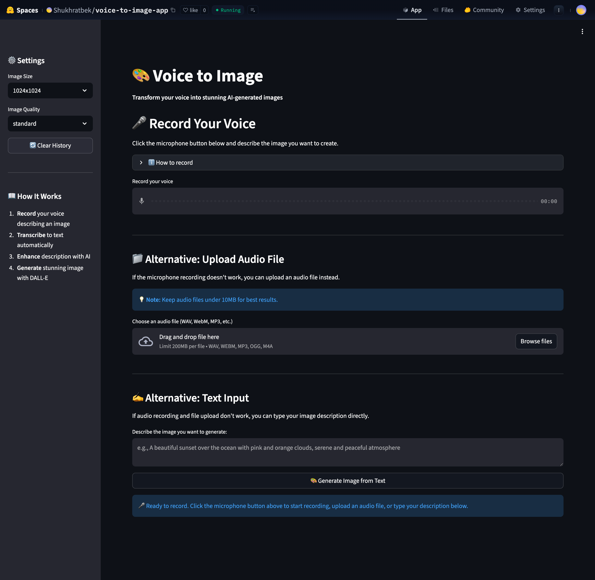
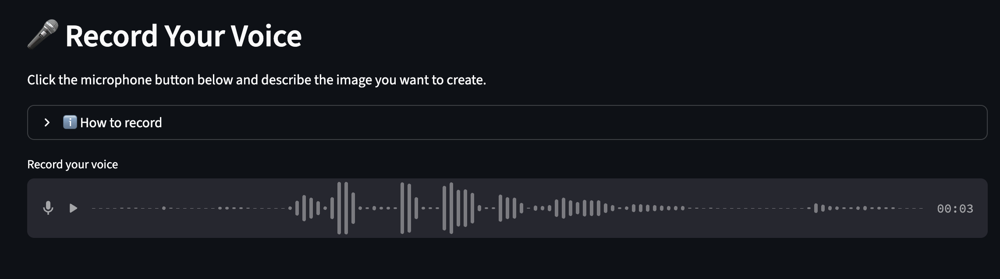
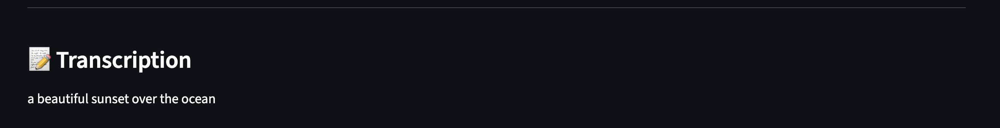
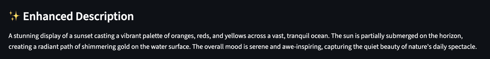
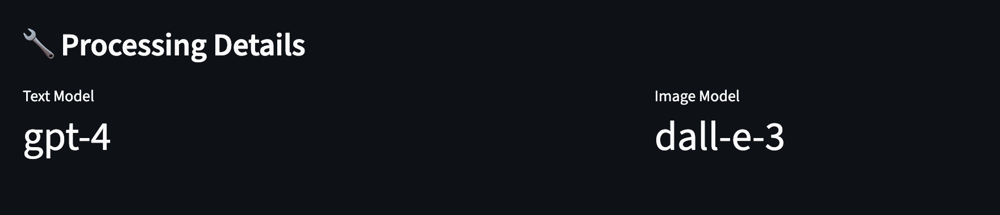

# Voice to Image App - Capstone Project 2

## Transform Your Voice into Stunning Images

This application converts short voice messages into AI-generated images. Simply describe what you want to see, and the app will create a beautiful image for you using advanced AI models.

🌐 **Live Demo**: [Try it on Hugging Face Spaces](https://huggingface.co/spaces/Shukhratbek/voice-to-image-app)

## Features

- 🎤 **Voice Input**: Record your voice describing the image you want
- 🧠 **AI Transcription**: Automatic speech-to-text conversion
- ✨ **Smart Enhancement**: LLM converts your description into detailed image prompts
- 🎨 **Image Generation**: Creates stunning images using DALL-E 3
- 📊 **Transparency**: View all intermediate steps (transcript, prompt, models used)
- 📝 **Console Logging**: All operations logged for debugging

## Requirements

- Python 3.8+
- OpenAI API key (for GPT-4 and DALL-E 3)
- Microphone (for voice recording)

## Installation

1. Clone the repository:
```bash
git clone <repository-url>
cd Generative-AI-Capstone-project/voice_to_image
```

2. Install dependencies:
```bash
pip install -r requirements.txt
```

**Note**: On some systems, you may need to install additional audio dependencies:
- **macOS**: `brew install portaudio`
- **Linux**: `sudo apt-get install portaudio19-dev python3-pyaudio`
- **Windows**: Usually works out of the box

3. Set up environment variables:
```bash
cp .env.example .env
```

Edit `.env` and add your credentials:
```
OPENAI_API_KEY=your_openai_api_key_here
```

## Usage

1. Start the Streamlit application:
```bash
streamlit run app.py
```

2. The application will open in your browser at `http://localhost:8501`

3. **Record your voice**:
   - Click the microphone button
   - Describe the image you want (e.g., "A serene sunset over mountains with purple and orange sky")
   - The app will automatically transcribe, enhance, and generate your image

4. **View results**:
   - See your transcribed text
   - View the enhanced image description
   - See the generated image
   - Check which models were used

## Example Workflow

### Step 1: Launch the Application

*The application starts with a clean interface ready for voice input*

### Step 2: Record Your Voice

*Click the microphone and describe your desired image*

### Step 3: View Transcription

*Your voice is automatically transcribed to text*

### Step 4: See Enhanced Description

*AI enhances your description into a detailed image prompt*

### Step 5: Generated Image

*DALL-E creates your image based on the enhanced description*

### Step 6: View Processing Details

*See all intermediate steps and models used*

## Architecture

### Components

1. **app.py**: Streamlit UI
   - Voice recording interface
   - Results display
   - Intermediate data visualization
   - History management

2. **agent.py**: AI Agent
   - `transcript_to_image_description()`: Converts transcript to detailed image prompt
   - `generate_image()`: Generates image using DALL-E
   - `process_voice_to_image()`: Complete pipeline orchestration
   - Console logging for all operations

3. **audio_processor.py**: Audio Processing
   - Voice transcription using Google Speech Recognition
   - Audio format conversion
   - Error handling

## How It Works

1. **Voice Recording**: User records a short voice message via Streamlit's audio input
2. **Transcription**: Audio is converted to text using Google Speech Recognition
3. **Enhancement**: GPT-4 converts the transcript into a detailed, professional image description
4. **Image Generation**: DALL-E 3 generates the image based on the enhanced description
5. **Display**: All intermediate steps and the final image are shown to the user

## Models Used

- **Text Model**: GPT-4 (or GPT-3.5-turbo) for converting transcripts to image descriptions
- **Image Model**: DALL-E 3 for image generation
- **Speech Recognition**: Google Speech Recognition API

## Console Logging

All operations are logged to the console with timestamps:
- Voice transcription attempts
- Image description generation
- Image generation requests
- Success/failure status
- Model usage and tokens

## Configuration

### Image Settings

In the sidebar, you can configure:
- **Image Size**: 1024x1024, 1792x1024, or 1024x1792
- **Image Quality**: Standard or HD (DALL-E 3 only)

### Model Selection

Edit `agent.py` to change models:
```python
self.text_model = "gpt-4"  # or "gpt-3.5-turbo"
self.image_model = "dall-e-3"  # or "dall-e-2"
```

## Troubleshooting

### Audio not recording
- Check microphone permissions
- Ensure microphone is connected and working
- Try a different browser

### Transcription fails
- Speak clearly and at a moderate pace
- Reduce background noise
- Check internet connection (uses Google Speech Recognition)

### Image generation fails
- Verify your OpenAI API key is valid
- Check you have sufficient API credits
- Ensure your API key has access to DALL-E 3

### Import errors
- Install all dependencies: `pip install -r requirements.txt`
- For PyAudio issues, install system dependencies (see Installation section)

## Deployment to Hugging Face Spaces

🌐 **Live Application**: [https://huggingface.co/spaces/Shukhratbek/voice-to-image-app](https://huggingface.co/spaces/Shukhratbek/voice-to-image-app)

The application can be deployed to Hugging Face Spaces using Docker:

1. Create a new Space on Hugging Face
2. Select "Docker" as the SDK
3. Upload all files including `Dockerfile`
4. Set `OPENAI_API_KEY` in Space settings as a secret
5. The Space will automatically build and deploy

See `DEPLOYMENT.md` for detailed instructions.

## License

This project is part of a Generative AI Capstone project.

## Contact

For issues or questions, please create an issue in the repository.


